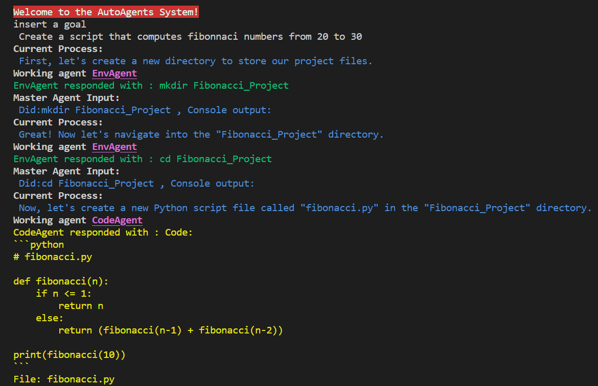
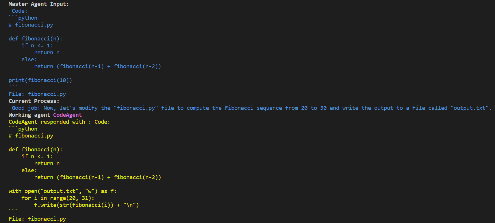
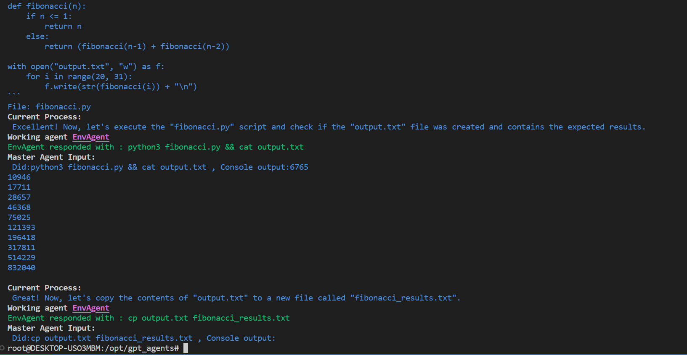

# AutoAgents System
This project is an automated Python testing system that uses a three-agent model to manage the project, generate code, and control the hardware/environment. The agents are MasterAgent, CodeAgent, and EnvAgent.

## Installation
First, install the required packages:

```bash
pip install openai
pip install termcolor
```
## Configuration
Create a config.ini file in the project directory with your OpenAI API key:
```text
[openai]
key = YOUR_API_KEY
```
## Usage
Run the main.py script:

```bash
python main.py
```
The system will prompt you for a goal, and the MasterAgent will guide you through the process of achieving that goal by providing tasks and delegating them to the appropriate specialized agents (CodeAgent or EnvAgent).

## Agents
- MasterAgent: Manages the overall project status, provides tasks, and delegates tasks to the appropriate specialized agents.
- CodeAgent: Generates and manages Python code.
- EnvAgent: Controls the hardware and environment, executing commands and actions.
The MasterAgent oversees the interactions between the CodeAgent and the EnvAgent, ensuring seamless communication and coordination.

##Functions
The script includes several functions to manage agent files, call agents, parse agent responses, and execute commands. The `loop_interaction()` function enables the continuous interaction between the agents and user, while the `main()` function initializes the agents and starts the interaction loop.

For more details, refer to the comments and code in the main.py script.

##Demonstration
To showcase the AutoAgents System, we've provided a series of images that demonstrate the interaction between the agents and the user.

*Image 1 - Initial Setup and Goal Input, Agents tasks*



*Image 2 - Code correction by MasterAgent*




*Image 3 - Test and auto exit*


